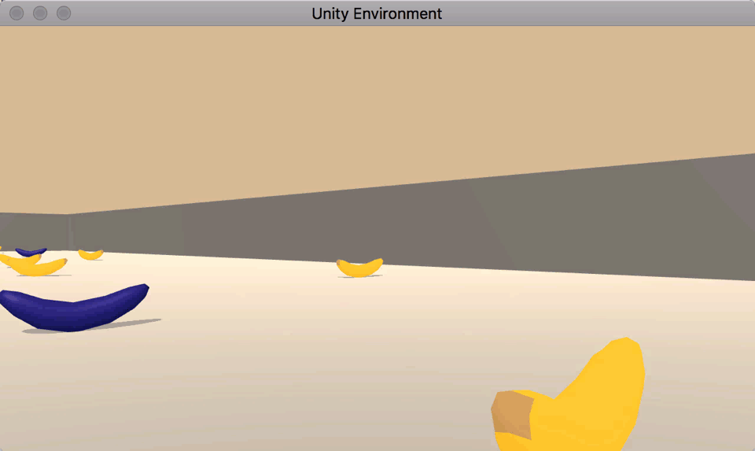

# p1-Navigation-RL
[//]: # (Image References)

[image1]: https://user-images.githubusercontent.com/10624937/42135619-d90f2f28-7d12-11e8-8823-82b970a54d7e.gif "Trained Agent"

## Introduction

This project and the associated code are meant to serve as an assignment project for the partial fulfilment of the Deep Reinforcement Learning Nanodegree.The project aim is to  **Train an agent to navigate a virtual world and collect as many yellow bananas as possible while avoiding blue bananas**

In this setup the aegnt gets +1 when it collects a yellow banana and -1 when it collects blue ones. The reinforcement learning system actions are directed to wards maximizing cumulative scores thus, the agent tries to end up with a policy which says it’s better to avoid the blue ones and collect more yellows, by changing its actions on certain states.

![Trained Agent][image1]

 

The state space has 37 dimensions and contains the agent's velocity, along with ray-based perception of objects around agent's forward direction.  Given this information, the agent has to learn how to best select actions.  Four discrete actions are available, corresponding to:
- **`0`** - move forward.
- **`1`** - move backward.
- **`2`** - turn left.
- **`3`** - turn right.

The task is episodic, and in order to solve the environment, your agent must get an average score of +16 over 100 consecutive episodes.

### Method

The way `Navigation.ipynb` unfolds:
1. Initialize the agent 
2. Evaluate state and action space
3. Learn from it using Deep Q-Networks (DQN). 
4. Iterate until agent reaches a threshold score of 16.0

## Getting Started

1. Download the environment from one of the links below.  You need only select the environment that matches your operating system:
    - Linux: [click here](https://s3-us-west-1.amazonaws.com/udacity-drlnd/P1/Banana/Banana_Linux.zip)
    - Mac OSX: [click here](https://s3-us-west-1.amazonaws.com/udacity-drlnd/P1/Banana/Banana.app.zip)
    - Windows (32-bit): [click here](https://s3-us-west-1.amazonaws.com/udacity-drlnd/P1/Banana/Banana_Windows_x86.zip)
    - Windows (64-bit): [click here](https://s3-us-west-1.amazonaws.com/udacity-drlnd/P1/Banana/Banana_Windows_x86_64.zip)
    
    (_For Windows users_) Check out [this link](https://support.microsoft.com/en-us/help/827218/how-to-determine-whether-a-computer-is-running-a-32-bit-version-or-64) if you need help with determining if your computer is running a 32-bit version or 64-bit version of the Windows operating system.

    (_For AWS_) If you'd like to train the agent on AWS (and have not [enabled a virtual screen](https://github.com/Unity-Technologies/ml-agents/blob/master/docs/Training-on-Amazon-Web-Service.md)), then please use [this link](https://s3-us-west-1.amazonaws.com/udacity-drlnd/P1/Banana/Banana_Linux_NoVis.zip) to obtain the environment.

2. Place the file in the working folder and unzip the file

## Instructions

Start working with `Navigation.ipynb`
