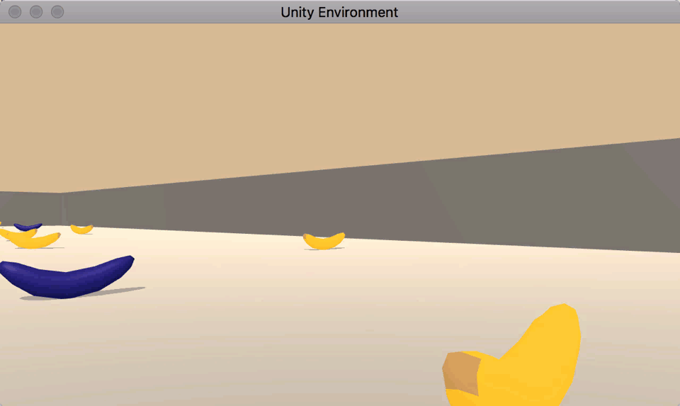
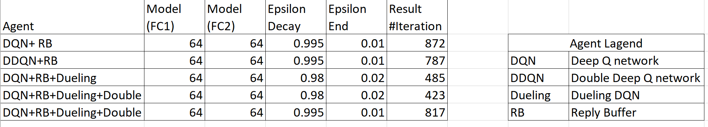
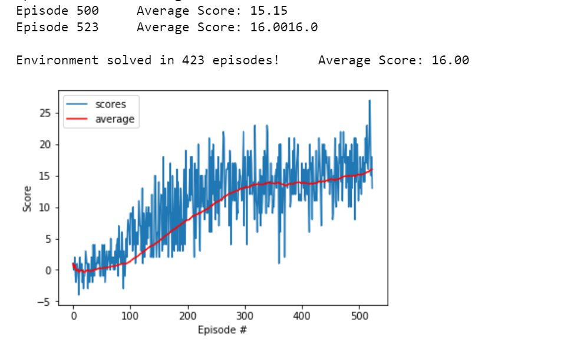

# Udacity Deep Reinforcement Learning Nanodegree 
# Project 1: Navigation

## Table of Contents
1. [Description](Description])
2. [Environment](Environment)
3. [Getting Started](Getting_Started)
   * [Installing](Installing)
   * [Executing Program](Executing_Program)
   * [File Description](File_Description)
4. [Establish Baseline Using A Random Action Policy](Establish_baseline_using_a_random_action_policy)
5. [Description Of Algorithms Used](Description_of_algorithms_used)
6. [Run Experiments to measure agent performance](Run_experiments_to_measure_agent_performance)
7. [Select best performing agent and capture video of it navigating the environment](Select_best_performing_agent_and_capture_video_of_it_navigating_the_environment)
8. [Authors](Authors)
9. [License](License)
10. [Acknowledgement](Acknowledgement)

## Description
This report as well as the ssociated code are meant to serve as an assignment project for the partial fulfilment of Deep Reinforcement Learning Nanodegree hosted by Udacity.The goal of this project is to  **Train an agent to navigate a virtual world and collect as many yellow bananas as possible while avoiding blue bananas**



In this setup the aegnt gets +1 when it collects a yellow banana and -1 when it collects blue ones. The reinforcement learning system actions are directed to wards maximizing cumulative scores thus, the agent tries to end up with a policy which says it’s better to avoid the blue ones and collect more yellows, by changing its actions on certain states.
At first, in the notebook file, the dependencies are installed, libraries are imported, the simulation environment is initialized.
The next step is to explore the State and Action Spaces. State space is a vector composed by 37 features including the agent's velocity, along with ray-based perception
of objects around the agent's forward direction and, the action space, has a dimension of four (turn left and right, move forward and backward.
To learn how the Python API controls the agent and receives the feedbacks from the environment, a code cell is provided with a random action agent.

Agents use a policy to decide which actions to take within an environment. The primary objective of the learning algorithm is to find an optimal policy&mdash;i.e., a policy that maximizes the reward for the agent. Since the effects of possible actions aren't known in advance, the optimal policy must be discovered by interacting with the environment and recording observations. Therefore, the agent "learns" the policy through a process of trial-and-error that iteratively maps various environment states to the actions that yield the highest reward. This type of algorithm is called **Q-Learning**.

 We provide below details related to the motivation for this work, installation of the code, main findings etc below.


## Environment <a name="Environment"></a>

The environment is based on [Unity ML-agents](https://github.com/Unity-Technologies/ml-agents)

Note: The project environment provided by Udacity is similar to, but not identical to the Banana Collector environment on the Unity ML-Agents GitHub page.

> The Unity Machine Learning Agents Toolkit (ML-Agents) is an open-source Unity plugin that enables games and simulations to serve as environments for training intelligent agents. Agents can be trained using reinforcement learning, imitation learning, neuroevolution, or other machine learning methods through a simple-to-use Python API. 

A reward of +1 is provided for collecting a yellow banana, and a reward of -1 is provided for collecting a blue banana. Thus, the goal of the agent is to collect as many yellow bananas as possible while avoiding blue bananas.

The state space has 37 dimensions and contains the agent's velocity, along with ray-based perception of objects around the agent's forward direction. 

Given this information, the agent has to learn how to best select actions. Four discrete actions are available, corresponding to:

- 0 - move forward.
- 1 - move backward.
- 2 - turn left.
- 3 - turn right.

The task is episodic, and **in order to solve the environment, the agent must get an average score of +16 over 100 consecutive episodes.**

## Getting Started <a name="Getting_Started"></a>
### Step 1: Setup Environmnet : 
please follow the instructions in the DRLND GitHub repository[https://github.com/udacity/deep-reinforcement-learning] to set up your Python environment. These instructions can be found in README.md at the root of the repository. By following these instructions, you will install PyTorch, the ML-Agents toolkit, and a few more Python packages required to complete the project.

(For Windows users) The ML-Agents toolkit supports Windows 10. While it might be possible to run the ML-Agents toolkit using other versions of Windows, it has not been tested on other versions. Furthermore, the ML-Agents toolkit has not been tested on a Windows VM such as Bootcamp or Parallels.

The specific files to look into in the repository is `python/setup.py and requiremnets.txt`.The readme is pretty clear to setup the environmnet

### Step 2: Download the Unity Environment
For this project, you will not need to install Unity - this is because we have already built the environment for you, and you can download it from one of the links below. You need only select the environment that matches your operating system:

Linux: click here
Mac OSX: click here
Windows (32-bit): click here
Windows (64-bit): click here
Then, place the file in the p1_navigation/ folder in the DRLND GitHub repository, and unzip (or decompress) the file.

(For Windows users) Check out this link if you need help with determining if your computer is running a 32-bit version or 64-bit version of the Windows operating system.

### Installing <a name="Installing"></a>
To clone the git repository:

```[git clone debjani-bhowmick/p1-drl-navigation)](https://github.com/debjani-bhowmick/p1-drl-navigation)```

### Executing Program <a name="Executing_Program"></a>
You can run the `Navigation.ipynb` notebook in the project's directory to train model and save the model.


### File Description <a name=" File_Description"></a>
This project structure is divided into three directories:


<b> model.py:</b> 

<b> dqn_agent.py:</b>

<b> Navigation.ipynb:</b> notebook that will help you understand how the agent works step by step using different algorithms

<b> folder:python:</b>

<b> folder:chcekpoints:</b>

<b>folder:Imgaes:</b>


### Establish Baseline <a name="Establish Baseline"></a>

Before building an agent that learns, I started by testing an agent that selects actions (uniformly) at random at each time step.

```python
env_info = env.reset(train_mode=False)[brain_name] # reset the environment
state = env_info.vector_observations[0]            # get the current state
score = 0                                          # initialize the score
while True:
    action = np.random.randint(action_size)        # select an action
    env_info = env.step(action)[brain_name]        # send the action to the environment
    next_state = env_info.vector_observations[0]   # get the next state
    reward = env_info.rewards[0]                   # get the reward
    done = env_info.local_done[0]                  # see if episode has finished
    score += reward                                # update the score
    state = next_state                             # roll over the state to next time step
    if done:                                       # exit loop if episode finished
        break

print("Score: {}".format(score))
```

Running this agent I got a score of zero. Obviously, if the agent needs to achieve an average score of 16 over 100 consecutive episodes, then choosing actions at random won't work.


## Description of algorithms used <a name="Description of algorithms used"></a>

#### Q-Function
To discover an optimal policy, I setup a Q-function. The Q-function calculates the expected reward `R` for all possible actions `A` in all possible states `S`.


We can then define our optimal policy `π*` as the action that maximizes the Q-function for a given state across all possible states. The optimal Q-function `Q*(s,a)` maximizes the total expected reward for an agent starting in state `s` and choosing action `a`, then following the optimal policy for each subsequent state.


In order to discount returns at future time steps, the Q-function can be expanded to include the hyperparameter gamma `γ`.


#### Epsilon Greedy Algorithm
One challenge with the Q-function above is choosing which action to take while the agent is still learning the optimal policy. Should the agent choose an action based on the Q-values observed thus far? Or, should the agent try a new action in hopes of earning a higher reward? This is known as the **exploration vs. exploitation dilemma**.

To address this, I implemented an **𝛆-greedy algorithm**. This algorithm allows the agent to systematically manage the exploration vs. exploitation trade-off. The agent "explores" by picking a random action with some probability epsilon `𝛜`. However, the agent continues to "exploit" its knowledge of the environment by choosing actions based on the policy with probability (1-𝛜).

Furthermore, the value of epsilon is purposely decayed over time, so that the agent favors exploration during its initial interactions with the environment, but increasingly favors exploitation as it gains more experience. The starting and ending values for epsilon, and the rate at which it decays are three hyperparameters that are later tuned during experimentation.

You can find the 𝛆-greedy logic implemented as part of the `agent.act()` method [here](https://github.com/debjani-bhowmick/p1-drl-navigation/master/model/agent/agent.py#L66) in `agent.py` of the source code.


#### Deep Q-Network (DQN)
With Deep Q-Learning, a deep neural network is used to approximate the Q-function. Given a network `F`, finding an optimal policy is a matter of finding the best weights `w` such that `F(s,a,w) ≈ Q(s,a)`.

The neural network architecture used for this project can be found [here](https://github.com/debjani-bhowmick/p1-drl-navigation/master/model/model.py#L5) in the `model.py` file of the source code. The network contains three fully connected layers with 64, 64, and 4 nodes respectively. Testing of bigger networks (more nodes) and deeper networks (more layers) did not produce better results.

As for the network inputs, rather than feeding-in sequential batches of experience tuples, I randomly sample from a history of experiences using an approach called Experience Replay.


#### Experience Replay
Experience replay allows the RL agent to learn from past experience.

Each experience is stored in a replay buffer as the agent interacts with the environment. The replay buffer contains a collection of experience tuples with the state, action, reward, and next state `(s, a, r, s')`. The agent then samples from this buffer as part of the learning step. Experiences are sampled randomly, so that the data is uncorrelated. This prevents action values from oscillating or diverging catastrophically, since a naive Q-learning algorithm could otherwise become biased by correlations between sequential experience tuples.

Also, experience replay improves learning through repetition. By doing multiple passes over the data, our agent has multiple opportunities to learn from a single experience tuple. This is particularly useful for state-action pairs that occur infrequently within the environment.

The implementation of the replay buffer can be found [here](https://github.com/debjani-bhowmick/p1-drl-navigation/master/model/agent/agent.py#L133) in the `agent.py` file of the source code.


#### Double Deep Q-Network (DDQN)
One issue with Deep Q-Networks is they can overestimate Q-values (see [Thrun & Schwartz, 1993](https://www.ri.cmu.edu/pub_files/pub1/thrun_sebastian_1993_1/thrun_sebastian_1993_1.pdf)). The accuracy of the Q-values depends on which actions have been tried and which states have been explored. If the agent hasn't gathered enough experiences, the Q-function will end up selecting the maximum value from a noisy set of reward estimates. Early in the learning process, this can cause the algorithm to propagate incidentally high rewards that were obtained by chance (exploding Q-values). This could also result in fluctuating Q-values later in the process.


We can address this issue using Double Q-Learning, where one set of parameters `w` is used to select the best action, and another set of parameters `w'` is used to evaluate that action.  


The DDQN implementation can be found [here](https://github.com/debjani-bhowmick/p1-drl-navigation/master/agent/agent.py#L96) in the `agent.py` file of the source code.


#### Dueling Agents
Dueling networks utilize two streams: one that estimates the state value function `V(s)`, and another that estimates the advantage for each action `A(s,a)`. These two values are then combined to obtain the desired Q-values.  


The reasoning behind this approach is that state values don't change much across actions, so it makes sense to estimate them directly. However, we still want to measure the impact that individual actions have in each state, hence the need for the advantage function.

The dueling agents are implemented within the fully connected layers [here](https://github.com/debjani-bhowmick/p1-drl-navigation/master/model/model.py#L21) in the `model.py` file of the source code.


### Model parameters and results

The agent uses the following parameters values (defined in dqn_agent.py)

```
BUFFER_SIZE = int(1e5)  # replay buffer size
BATCH_SIZE = 64         # minibatch size
GAMMA = 0.99            # discount factor
LR = 5e-4               # learning rate
TAU = 1e-3              # for soft update of target parameters
UPDATE_EVERY = 4 
Optimizer : Adam
```

The Neural Networks use the following architecture (defined in model.py):

```
Input nodes (37) -> Fully Connected Layer (64 nodes, Relu activation) -> Fully Connected Layer (64 nodes, Relu activation) -> Ouput nodes (4)
```


Given the chosen architecture and parameters, our results are :

### 4. Run Experiments:

Now that the various components of our algorithm are in place, it's time to measure the agent's performance within the Banana environment. Performance is measured by the fewest number of episodes required to solve the environment.

The table below shows the complete set of experiments. These experiments compare different combinations of the components and hyperparameters discussed above. However, note that all agents utilized a replay buffer.




### 5. Select best performing agent

The best performing agents were able to solve the environment in 200-250 episodes. While this set of agents included ones that utilized Double DQN and Dueling DQN, ultimately, the top performing agent was a simple DQN with replay buffer.




**These results meets the project's expectation as the agent is able to receive an average reward (over 100 episodes) of at least +13 ( I kept 16 as limit). This agent met the criteria with least iteration, so I choose it as best among others.

### Lic<b>ensing, Authors, Acknowledgements <a name=" Licensing, Authors, Acknowledgements"></a>
<b> Author:</b> Debjani Bhowmick
  
<b> Acknowledgements: </b>Udacity for providing an amazing Data Science Nanodegree Program


